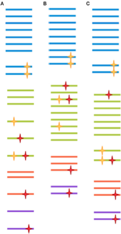
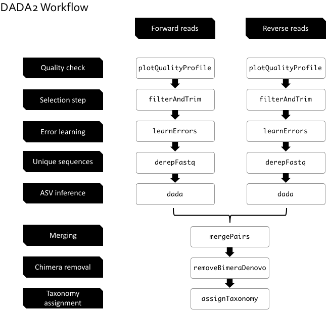

<br>


# Introduction
<br>

DADA2 is a bioinformatics pipeline created by [Callahan et al., 2016](https://www.ncbi.nlm.nih.gov/pubmed/27214047). It consists is a series of steps which filter the raw sequences obtained with Illumina sequencing. The final step is to obtain the taxonomy of the sequences that have been filtered in order to study the microbial community.  

DADA2 has two major features which distinguishes it from other commonly used pipelines. On one hand, it will proceed to the modeling of the sequencing error  which is supposed to make it possible to distinguish mutant sequences from erroneous sequences. On the other hand, unlike other pipelines such as QIIME or Mothur, DADA2 does not cluster 97% similar sequences in Operational Taxonomy Units (OTUs). Its **Amplicon Sequence Variants** (ASVs) are not grouped if the sequences are not 100% identical. See figure above. 


Originally constructed for 16S marker gene sequences (Bacteria), we will use it with ITS marker gene (Fungi) sequences from Illumina MiSEQ 2x300 bp paired-end sequencing. To speed up the execution of each step, we randomly sub-sampled a dataset in order to only keep 1000 sequences per sample.
Finally, *Redde Caesari quae sunt Caesaris* : this tutorial was largely inspired by the original [DADA2 tutorial](https://benjjneb.github.io/dada2/tutorial.html).


In general, before starting this pipeline, we must take some precautions:

1.   Samples must be **demultiplexed**: split into individual per-sample fastq files.  
2.    If the sequences are paired-end, the forward and reverse sequences have to be in distinct fastq files but must contain reads in **matched order**.  
3.   The nucleotides which are not part of the amplicon (primers and adapters) have to be removed. They can also be removed at the filtring step.  
4.    Most functions have a multithreading option that allows faster computing time by accessing multiple processors. Just specify *multithread = TRUE* to enable it. <span style="color:red">Warning, this option does not work under Windows.
</span>

This figure taken from [Hugerth and Andersson, 2017](https://www.ncbi.nlm.nih.gov/pubmed/28928718) illustrates the theoretical difference between OTUs and ASV. Each color represents a clade. Yellow stars indicate mutations, red stars indicate amplification or sequencing errors. The size of the space between the sequences indicates their clustering.

<center>

 

</center>

<br>

**(A) 100 % identity clustered OTUs.**   
The slightest variation of sequences causes the creation of a new group. The mutant sequences and the erroneous sequences are treated similarly.   
**(B) 97 % identity clustered OTUs.**   
A wider grouping allows to no longer consider the erroneous sequences, however the mutant sequences will also be clustered in the consensus group. 
**(C) ASVs.** 
Learning the error rates theoretically enables to group the erroneous sequences with the consensus sequences. In contrast, the mutant sequences are considered integrally.

<br>

<center>



</center>

<br>

# Let's start !
<br>

First, we're going to load the DADA2 package. You should have the latest version: `packageVersion('dada2')`. Then we're going to create a variable (path) indicating the path which will allow to access the objects required for this pipeline.
```{r package, include=TRUE}
library(dada2); packageVersion("dada2")
path <- "data/ITS_sub/"
```

#### Let's check where the path leads to...

<center>


</center>  
<br>

```{r path, include=TRUE}
list.files(path)
```

You should see the names of the fastq files.  
  
Now, we're going to read in the names of the fastq files, and perform some string manipulation to get lists of the forward and reverse fastq files. The sort function ensures forward/reverse reads are in the same order.

```{r sort, include=TRUE}
fnFs <- sort(list.files(path, pattern="_R1.fastq"))
fnRs <- sort(list.files(path, pattern="_R2.fastq"))
```

Given that the forward/reverse fastq pairs belong to the same sample, we are going to extract the name and save it in a variable. In this case, we assume that the filenames have this type of format: SAMPLENAME_XXX.fastq.

```{r samplenames, include=TRUE}
sample.names <- sapply(strsplit(fnFs, "_"), `[`, 1)
sample.names 
```

Now, specify the full path to the fnFs and fnRs. 

```{r file.path, include=TRUE}
fnFs <- file.path(path, fnFs)
fnRs <- file.path(path, fnRs)
```

For the maniacs among us, this script allows to order the names of the samples.  
```{r maniaque, include=TRUE}
library(gtools)
sample.names <- mixedsort(sample.names) 
fnFs <- mixedsort(fnFs)
fnRs <- mixedsort(fnRs)
sample.names
```

<center>

</center>
<br>

# Quality profile
<br>

This first step allows to visualize the sequences quality thanks to the individual Q score of each nucleotide.
```{r quality_profile_ind, include=TRUE, cache=TRUE,fig.height=4,fig.width=5,fig.align='center'}
plotQualityProfile(fnFs[1]) # 1st Forward sample
plotQualityProfile(fnRs[1]) # 1st Reverse sample
```

In these figures, the median is in green and the quartiles are the dotted orange lines. Here we only plotted the first forward and reverse fastq (fnFs[1] and fnRs[1]), but it is possible to plot multiple figures(fnFs[x:y]) or aggregate them as follows. 

```{r quality_profile_agg, include=TRUE, cache=TRUE,fig.height=4,fig.width=5,fig.align='center'}
plotQualityProfile(fnFs, aggregate = TRUE)
plotQualityProfile(fnRs, aggregate = TRUE)
```


The analysis of these figures helps to choose the filtring and trimming parameters of the next step. The Q score index gives us information on sequencing's accuracy (see table). 

Q score|Precision
--|--
10|90 % 
20|99 %
30|99.9 %
40|99.99 %

Another tool for evaluating sequence quality: [FastQC](https://www.bioinformatics.babraham.ac.uk/projects/fastqc/).  


# Filtering and Trimming  
<br>

First we will create a directoy (filtered_pairedend) and  objects (filtFs and filtRs) to store the filtered sequences. 

```{r filt_path, include=TRUE}
filt_path <- file.path(path, "filtered_pairedend") 
filtFs <- file.path(filt_path, paste0(sample.names, "_F_filt.fastq.gz"))
filtRs <- file.path(filt_path, paste0(sample.names, "_R_filt.fastq.gz"))
```

Let's procede with the **filterAndTrim** function, its output will be stored in the **out** object.

```{r filt_trim, include=TRUE,cache=TRUE}
out <- filterAndTrim(fnFs, filtFs, fnRs, filtRs, 
                     truncQ=6,
                     truncLen = c(280,280),
                     trimLeft=c(18,20),
                     maxEE=c(2,2))
                     #multithread=TRUE)
                
```
<br>

First, the function needs the unfiltered sequences (fnFs and FnRs) as well as the names of the objects of the filtered sequences (filtFs and filtRs). Several parameters can then be modified as we wish:

*   truncQ: sets a minimum Q score. At the first instance of a quality score less than or equal to truncQ, the sequence is truncated.
*   truncLen: sets the length at which the sequences will be truncated. Sequences shorter than the length are eliminated.
*   trimLeft: sets the length that will be removed on the 5' side of the reads. This allows you to remove the primers if it has not been done beforehand.  
(Primers:  
ITS3_KYO2: 	GATGAAGAACGYAGYRAA = 18bp  
ITS4:	TCCTCCGCTTATTGATATGC = 20b)
*   maxEE: sets the maximum number of “expected errors” allowed in a read. This filter is based on the Q index. The more the number is increased, the less strict we are. 

Other settings can also be changed, they are accessible on the help page of the function : ?FilterAndTrim.
<br>

#### Filtering visualization
```{r out, include=TRUE,cache=TRUE}
pourc <- cbind((out[,2]/out[,1])*100) # Percentage filtered sequence / non-filtered sequence
pourc_disc <- cbind(out, pourc) # combines out and pourc
pourc_disc 
(mean(out[,2])/mean(out[,1]))*100 # Mean percentage 
```
<br>

<center>

 

</center>

#### Almost half of the reads didn't pass through the filtering parameters!  

<br>

>#### <span style="color:red">CHALLENGE</span> 
Draw the quality profile of the first sample once filtered and compare it to its unfiltered quality profile. Use the **plotQualityProfile** function.

<br>

Other filtering tools exist like: [Trimmomatic](http://www.usadellab.org/cms/?page=trimmomatic).</span>

<br>

# Error Rates Learning 
<br>

This step consist in estimating the error rates due to sequencing. Its purpose is to differentiate between mutant sequences and false sequences. The error model is computed by alternating estimation of the error rates and inference of sample composition until they converge on a jointly consistent solution. 

```{r err, include=TRUE,cache=TRUE}
errF <- learnErrors(filtFs)
errR <- learnErrors(filtRs)
#multithread=TRUE
```

The minimum number of sequences to use for error rate learning can be specified with the *nreads* parameter.</span>

<br>

#### Error rate visualization
```{r viz_err, include=TRUE,cache=TRUE,warning=FALSE,fig.height=4,fig.width=5,fig.align='center'}
plotErrors(errF, nominalQ=TRUE)
plotErrors(errR, nominalQ=TRUE)
```

The error rates for each possible transition (eg. A->C, A->G, …) are shown. Points are the observed error rates for each consensus quality score. The black line shows the estimated error rates after convergence. The red line shows the error rates expected under the nominal definition of the Q-value (for Illumina technology).

<br>

# Dereplicating 
<br>

Combines all identical sequencing reads into into *unique sequences* with a corresponding *abundance*. It will reduce subsequent computation time by eliminating redundant comparisons. The dereplicated sequences take the name of the samples from which they come.  

```{r derep, include=TRUE,cache=TRUE}
derepFs <- derepFastq(filtFs)
names(derepFs) <- sample.names

derepRs <- derepFastq(filtRs)
names(derepRs) <- sample.names
```

The advantage of DADA2 lies in the fact that it retains a summary of the quality information associated with each *unique sequence*. The consensus quality profile of a *unique sequence* is the average of the positional qualities from the dereplicated reads. These quality profiles inform the error model of the subsequent sample inference step, significantly increasing DADA2’s accuracy.</span>  

<center>


</center>  

<br>

# Sample Inference  
<br>

```{r dada, include=TRUE,cache=TRUE,}
dadaFs <- dada(derepFs, 
               err = errF, 
               #multithread=TRUE,
               pool=TRUE)
               
               

dadaRs <- dada(derepRs, 
               err=errR,
               #multithread=TRUE,
               pool=TRUE)
               

dadaFs[[1]]
dadaRs[[1]]

#save(dadaRs, file="data/dadaRs.rdata")
#save(dadaFs, file="data/dadaFs.rdata")
```
<br>

# Merging paired reads

<br>

<center>


</center>

<br>

The whole point of paired-end sequencing lies in the goal of merging the two strands to increase our confidence in their reliability. Merging also makes it possible to obtain longer amplicons.  
The function **mergePairs**  needs to be provided with the objects computed in the two preceding stages (derep and dada). Then, the parameters we can freely modify are:

* minOverlap: sets the minimum size of the overlap of the sense and antisense strands for their merge to be accepted. Sequences that are not merged are discarded. <br> 
* maxMismatch: sets the maximum number of nucleotidic incompatibilities in the overlap. <br> 

Other settings can also be changed, they are accessible on the help page of the function : ?mergePairs. For example, if returnRejects = TRUE, pairs that were rejected because of mismatches in the overlap region are kept in the output.

```{r merge, include=TRUE,cache=TRUE}
mergers <- mergePairs(dadaFs, derepFs, dadaRs, derepRs, 
                      minOverlap = 12, 
                      maxMismatch = 0)
                      
```
<br>

#### Let's inspect the results! 

```{r merge_inspect, include=TRUE,cache=TRUE}
head(mergers[[1]])
max(mergers[[1]]$nmatch) # Largest overlap 
min(mergers[[1]]$nmatch) # Smallest overlap           
```

<br>

# ASVs table   

<br>

We finally have our ASVs which we are going to store in the *seqtab* object. 

```{r seqtab, include=TRUE,cache=TRUE}
seqtab <- makeSequenceTable(mergers)
dim(seqtab)
seqtab[,1]
   
```

We get **`r dim(seqtab)[2]`**  ASVs from the **`r as.integer(colSums(out)[1])`** raw sequences we had at the beginning. seqtab [, 1] gives the number of times the first ASV's sequence is found in each sample.</span>    
<br>

####  Let's inspect the ASVs' lengths 

<br>

```{r seqtab_length, include=TRUE,fig.height=4,fig.width=5,fig.align='center'}
hist(nchar(getSequences(seqtab)),xlab="Size", ylab="Frequency", main = "ASVs length", xlim=c(250,450), ylim=c(0,250)) 
```
<br>

# Removing chimeras  
<br>
<center>


</center>

<br>

This step aims at removing all non-biological sequences, the samples in the ASV table are all pooled together for bimera identification. Other methods can be used like the consensus method where samples are checked *individually* for bimeras.</span>  


```{r chim_remove, include=TRUE,cache=TRUE}
seqtab.nochim <- removeBimeraDenovo(seqtab, 
                                    method = "pooled", 
                                    #multithread = TRUE,
                                    verbose = TRUE) 
#save(seqtab.nochim, file="data/seqtab.nochim.rdata")
```
<br>

#### Let's inspect the results !

<br>

```{r chim_dim, include=TRUE,,fig.height=4,fig.width=5,fig.align='center'}
round((sum(seqtab.nochim)/sum(seqtab)*100),2) # Percentage of the total sequence reads
hist(nchar(getSequences(seqtab.nochim)),xlab="Size", ylab="Frequency", main = "Non-chimeric ASVs length", xlim=c(250,450), ylim=c(0,250)) # Lenght of the non-chimeric sequences
```

Now we can  transform the ASVs occurrences in presence / absence which will allow to quantify the number of ASVs per sample.</span>  
```{r nochim_bin, include=TRUE,cache=TRUE}
seqtab.nochim.bin <- ifelse(seqtab.nochim>0,1,0) 
```
<br>

# Track table  
<br>

The following table shows how many sequences were eliminated at each step. An excessive loss in the number of sequences may indicate a problem. For example, if too few sequences pass the bimera removal step, it may indicate that there are still bits of primers with ambiguous nucleotides.

<br>

```{r track, include=TRUE,cache=TRUE}
getN <- function(x) sum(getUniques(x))
track <- data.frame(Input=as.numeric(out[,1]), # input
                    Filtered=as.numeric(out[,2]), # filtered
                    "Filt//In"=as.numeric(round(((out[,2]/out[,1])*100),2)),# % (Filtered / Input)
                    Merge = as.numeric(sapply(mergers, getN)), # Merged 
                    "Mer//In"=as.numeric(round(((sapply(mergers, getN)/out[,1])*100),2)),# % (Merged / Input)
                    Nonchim = as.numeric(rowSums(seqtab.nochim)),# Non-chimeric                       
                    "Nonchim//In"=as.numeric(round(((rowSums(seqtab.nochim)/out[,1])*100),2)),# % (Non-chimeric / Input)
                    ASV = as.numeric(rowSums(seqtab.nochim.bin))) # Number of ASVs per sample 
rownames(track) <- sample.names # Row names
head(track)
```

<br>

One picture is worth a thousand word!

```{r plot_track, include=TRUE,fig.height=4,fig.width=5,fig.align='center'}
library(ggplot2)
library(reshape2)

gtrack<- track[,c(1,2,4,6)]
gtrack$ID <- rownames(gtrack)

lgtrack <- melt(gtrack, id.vars="ID")
bar_track <- ggplot(lgtrack ,aes(x=ID, y=as.numeric(value), fill=variable)) +
      geom_bar(stat="identity", position = "identity") + 
      theme_classic() + # Theme
      theme(axis.ticks.length=unit(0.3,"cm")) + # Ticks size
      theme(axis.text.x = element_text(angle=45) , legend.title = element_blank())+ # Changes the x labels orientation & delete legend title
  scale_x_discrete(name ="Sample ID", limits=rownames(track))+ # Changes x-axis title & sorts the x label names
  scale_y_continuous(name="Abundance", breaks=seq(from = 0, to = 1000, by = 100))+ #Changes y-axis title & sets the y breaks.
  ggtitle("Track")# Main title
bar_track 
```
<br> 
  

# Taxonomy assignment
<br>

We are finally going to the end of the pipeline with this important step of taxonomic assignment. Thanks to the implementation of the naïve Bayesian classification method, the **assignTaxonomy** function takes as input all the sequences to be classified as well as reference set of sequences with known taxonomy. The taxonomic assignments are given with a minimum bootstrap confidence specified with the *minBoot* parameter. The database of references (UNITE) is accessible on this link https://unite.ut.ee/repository.php. Other databases are also [available](https://benjjneb.github.io/dada2/training.html). 

```{r assign_taxo, include=TRUE,cache=TRUE}
taxotab <- assignTaxonomy(seqtab.nochim,
                          refFasta = "reference_database/sh_general_release_dynamic_01.12.2017.fasta",
                          minBoot = 50, #Default 50. The minimum bootstrap #confidence for # assigning a taxonomic level.
                          multithread=TRUE)
 
save(taxotab, file = "data/taxotab.rdata")
#load("data/taxotab.rdata")
```
<br>

#### Let's inspect the results !

```{r taxo_exam, include=TRUE,cache=TRUE}
# view(taxotab) # Full taxonomy table 
write.table(taxotab[1:5,], row.names = FALSE) # First 5 ASVs' taxonomy without the ASV sequence
unique(unname(taxotab[,7])) # Number of unique species

```

We obtained **`r length(unname(taxotab[,7]))`** different ASVs of which **`r length(unique(unname(taxotab[,7])))-1`** have been identified at the species level


>#### <span style="color:red">CHALLENGE</span>
Can you find the number of different families? 

<br>

# Nota Bene 
<br>
<center>


</center>
<br>
  
*   Dada2 does not throw away singleton reads. However, it's not supposed infers biological sequence variants that are only supported by a single read - singletons are assumed too difficult to differentiate from errors. 

*    DADA2 consistently measures diversity across different filtering parameters and error rates. [OTU methods](https://twitter.com/bejcal/status/771010634074820608) do not. 

*    The ASVs with no species assignment do not match the same species in over 50% of the bootstrap replicate kmer-based assignments (see [Wang et al., 2007](https://www.ncbi.nlm.nih.gov/pubmed/17586664) for more info on the naive Bayesian classifier method).
